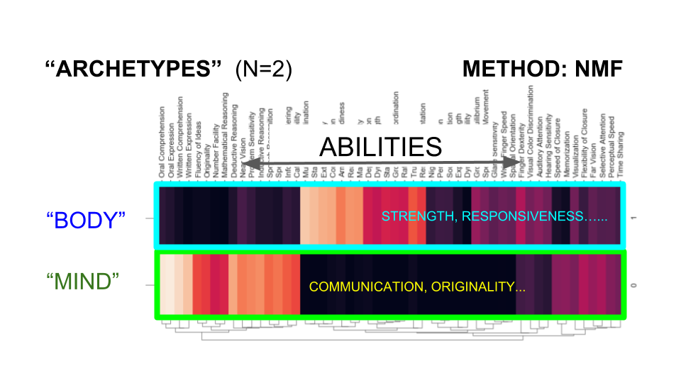

# OCCUPATIONAL ARCHETYPES: A 'MYERS-BRIGGS' FOR JOBS  

David Nordfors        
Github: dnordfors

## The Challenge: Grasping the Rapidly Changing Job Market and the Value of Talent 
Well paid jobs require abilities, skills and knowledge. The O*Net database maps the profiles for a wealth of occupations. Wages of people working in these occupations is available in the US Census ACS/PUMS database. With all the data available, top quality research and huge economic resources being put into human resources, still **only one out of twenty people have a job that fits them and that engages them**. The world's most important industry – the one that billions of people to work – has merely a *five percent* success rate. This is beyond a matter of lacking resources, there must be structural deficiencies. I am suggesting it lacks the language for analysing, strategizing and executing on goals.   

We are used to looking at what jobs require from people. But that is not working as well as it used to. Occupations are changing or disappearing at a high speed and confusion follows. 

### The O*NET Database
The O*NET database remains useful, it profiles nearly a thousand occupations, ranking what each occupation requires from workers, with regards to abilities, knowledge, skills, and so on. It covers in the order of two hundred features.

It has a hierarchical ordering: 23 Major occupation groups, 97 Minor ones, 461 Broad occupations and 840 Detailed occupations

Here below is a part of the O*NET database, showing the need of 52 abilities in the 461 broad occupations. The data is relevant and good, but challenging to overview at-a-glance; the plot is a pleasant piece of computer-generated art, not much else.   

## Proposal: Talent-Based Archetypes Covering Most Jobs
In this project I explore how data science can be used to construct a simple language for jobs and abilities that teams and individuals can use in daily speech. It is related to Jungian psychology and ‘archetypes’, like in the  ‘Myers-Briggs’ personality test, that already are in use in HR.  

The method has the following attractive features:
- **Archetypes are easily kept up-to-date**. If the O*Net data changes, or other data sources are added, the Archetypes adapt. 
- Archetypes are adaptable, they can be tailored to be relevant for subgroups. For example, Archetypes might be different in Alaska and Alabama. Archetypes created from the statistics of deaf people can differ from the average statistics.
- Archetypes have mathematical relevance. Their relevance can be measured and, if good enough, they will be useful for spotting and discussing trends and correlations. Spoken language and  mathematical analytics are kept in sync.  
- Archetypes may offer more insight and better recommendations when matching individual workers with jobs. They can say if there is a mismatch between archetypes for workers' talents, showing which combinations of human talent often co-occur, and the job-archetypes, showing with combinations the job-market typically accomodate.  

The construction of Archetypes has two steps. 

### 1. **Construct ‘Archetypes’: Unsupervised ML**      

The archetypes are constructed by applying NMF (Non-zero matrix factorization), a method that generally can be used for sorting data into 'topics', to the O*Net database. The number of Archetypes is set by choice. 

Here, the data in the Onet database, shown here above, has been reconstructed into two archetypical occupations, which might be labeled "body" and "mind", because of the way the abilities cluster. 

### 2. **Assess Their Predictive Powers: Supervised ML** 

Supervised machine learning connect archetypes to income statistics. When using all measured abilities, skills and knowledge as features (120 variables), ‘ball-park numbers’ for wages can be predicted for occupations. Predicted income vs actual income is shown in the figure. The goal for achetypes is to provide a simpler,  intuitive human language for understanding and planning the interaction between people with abilities and the occupations that fit them, as well as for applying to Data Science, maintaining predictive power. 

<!-- Docs to Markdown version 1.0β17 -->
