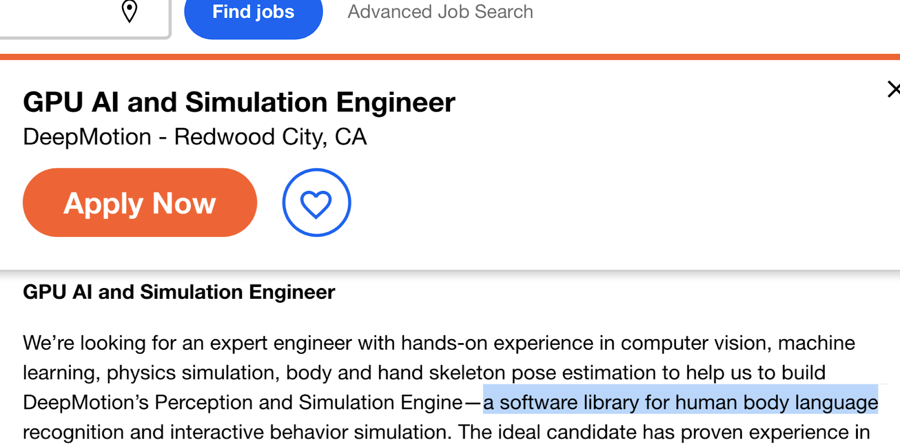

<!----- Conversion time: 2.806 seconds.

Using this Markdown file:

1. Cut and paste this output into your source file.
2. See the notes and action items below regarding this conversion run.
3. Check the rendered output (headings, lists, code blocks, tables) for proper
   formatting and use a linkchecker before you publish this page.

Conversion notes:

* Docs to Markdown version 1.0β16
* Fri Mar 22 2019 15:14:01 GMT-0700 (PDT)
* Source doc: https://docs.google.com/a/iiij.org/open?id=1umg56W0RYT-Tl_yIX8xpnEkKlUU7iZB3G4TnI7Mk6Ig
* This document has images: check for >>>>>  gd2md-html alert:  inline image link in generated source and store images to your server.

WARNING:
You have 2 H1 headings. You may want to use the "H1 -> H2" option to demote all headings by one level.

----->

# Capstone Project 

for the Galvanize Data Science Interactive / g88 Q1 2019

By David Nordfors 

Repository on GitHub: https://github.com/dnordfors/galvanize-capstone

#  Using Data Science to Explore New Sources For Talent: A ShowCase

## The Looming Talent Crunch

Numerous experts are predicting an increasing shortage of talent as a limiting factor for industry. McKinsey & Company noted[^1] that, in 2013, during the Great Recession, "it was harder to get entry-level work [at Walmart] than to be accepted by Harvard: 2.6 percent of Walmart applicants made it through, as opposed to 6.1 percent for the Ivy League university." But "In medium- and higher-complexity positions, where stronger performers have an increasingly disproportionate bottom-line impact, the opposite was true. … 'Failure to attract and retain top talent' was the number-one issue in the Conference Board's 2016 survey of global CEOs"

There is no reason to believe that this trend will change, and recruiting costs for special talent remains high. Therefore it may be of interest to industry to explore new and untapped sources for talent. 

Many of the highly talented members of the workforce suffer from undisclosed or undiagnosed disabling conditions. Anecdotal evidence has encouraged expectations that highly talented workers have 'quirks' and may not always fit the norm for general employees and  employers may be willing to accomodate their shortcomings in order to gain access to their strengths. But when the disabilities of people become official  the attention shifts from what they can do to what they cannot do, and job opportunities will be hard to come by.  

This project will explore the business case for people with disabilities as an untapped resource for high value talent, by using data science as a tool. 

## Coolabilities  

Many persons with disabilities have enhanced strengths, such as the superior ability of blind people to interpret sounds and touch, or the outstanding knack of autistic people to manage detail. Not so well-known is the potential of this large and untapped resource of excellence for the economy and society. We call these "superpowers"; _coolabilities_ — cool abilities.   

Powerful technologies are today ready to open the door to a new paradigm of work: instead of squeezing people into existing job slots, companies can instead tailor work that fits individuals' unique skills, talents, and passions, matching them with inspiring teams and offering them a choice of meaningful tasks.  This has tremendous benefits for both the employee and employer by  creating a "long-tail labor market" in which diversity brings competitive advantage. 

People with coolabilities can spearhead the new market for tailored jobs because they are a particularly underutilized resource. By mass- personalization of jobs, now enabled by AI, an individual's lack of what today is considered a 'basic requirement' can be circumvented by tailoring the vocation, or remedied by assistive technologies, for the purpose of tapping into what this person can do better than the average worker. 

Some examples of coolabilities that often accompany disabilities, and the STEM jobs that these enhanced abilities may match is shown in Table 1 [Grundwag 2016].  Mapping coolabilities  on disabilities, like in the table, is a cumbersome  task, because - until recently - these abilities have not been categorized, lacking a name and unique keyword. 

## Deaf People's Coolabilities

In the recent book "The People Centered Economy", Grundwag expands the table of coolabilities with additional conditions including profound hearing loss and deafness, whereof here are a select few (Grundwag 2018). We may assume that hitherto discovered coolabilities are the tip of the iceberg of many  enhanced abilities accompanying hearing loss. 

*   Enhancement of visual-spatial abilities
*   Enhanced ability to decode and interpret vibro-tactile stimuli, 
*   Enhanced language processing through visual modalities 
*   More attuned to body language 

These abilities are more than just 'trained coolabilities' which deaf people have become good at because they must practice sight-reading when they can't hear. There is evidence that these are 'singular coolabilities' that are very difficult for the hearing to match, because they come from repurposing the audial cortex for sight in the lack of sound. The vast capacity to remember words and interpret sentences,which belongs to the audial cortex, is transferred to the visual signals[^2]. Deafness may come with the ability to literally _read_ sentences of body language.

## A High Value Labor Market for the Coolabled 

We may understand the potential for a labor market by  considering deaf people's coolabilities for reading body language, Around 55% of the comprehension between people talking with each other is said to be body language, such as understanding the importance that underlie the words being exchanged[^3].  Deaf people may be superior in jobs where this matters a lot, for example as negotiators, because body language will usually reveal a bluff and convey confidence or uncertainty. Also, it's in a  negotiators interest that the other party has registered what has been said, and a severe hearing loss can be a 'contextual coolability', by bringing the other party out of their comfort zone, similar to playing a left-handed tennis player.  A very straightforward example of a job that can be matched by coolabilities for body language is the job ad below, a highly paid GPU AI and Simulation Engineering position, building a software library for human body language.

In this project I will explore which vocations deaf 'coolabled' people might do better than others. 

## Method

The project has two complementary approaches

### A: Predict Occupational Talent from Brain Research Results

1. **Build an ability profile**: Sample enhanced abilities, such as enhanced visual and tactile vibrational sensitivity will be selected from a literature study on brain plasticity and other relevant fields. 
2. **Match the ability profile with vocation profiles:**  \
Calculate a semantic distance to vocations.  \
Data Source:The official DOL[ O*Net database](https://www.onetcenter.org/database.html#all-files) lists >300 vocations with 52 abilities, such as "Oral Comprehension", "Written Expression", "Fluency of Ideas", "Originality", "Problem Sensitivity", "Number Facility", "Memorization", just to name a few.  Each ability is weighted by importance and level, respectively. 

### B:Discover Occupational Talent from Census Data

Data source: The US Census American Community Survey (ACS) Public Use Microdata Sample (PUMS)[^4] show the full range of population and housing unit responses collected on individual ACS questionnaires, for an anonymized subsample of the population. The PUMS files allow data users to conduct a custom analysis of the ACS data using a sample of actual responses to the American Community Survey (ACS). 

1. Compare the distribution of occupations between people with hearing difficulties and the average population.
2. For each occupation, compare the corresponding income distributions. Rank the occupations according to the quota, identifying occupations where the median income of people with hearing difficulties is the strongest in relation to the general median income. 

### C: Correlate Results from A and B

I will compare the results from A and B. The extent that the correlations from census data support the extrapolated predictions from brain research will serve as a quality ranking for the predictions.   

## Data Sources

- <b>Census: PUMS</b>   US Census American Community Survey Public Use Microdata Sample (PUMS): https://www.census.gov/programs-surveys/acs/technical-documentation/pums/documentation.html

- <b> DoL O*Net database </b>:  https://www.onetcenter.org/database.html#all-files

</b>

<table frame='box' border="1">
  <tr>
   <td colspan="4" align="left" ><strong>Table 1. Disabilities and Coolabilities</strong>:how coolabilities and disabilities may correlate,  generalizations about characteristics and attributes that may apply to any individual with these listed diagnosis. 
   </td>
  </tr>
  <tr align = "center">
   <td>
   </td>
   <td ><b>AUTISM SPECTRUM
DISORDER (ASD) (High Functioning)</b>
   </td>
     <td><b>ADHD (Attention Deficit Hyperactivity Disorder)</b>
   </td>
     <td><b>Dyslexia</b>
   </td>
  </tr>
  <tr>
   <td><b>Disabilities</b>
   </td>
   <td>Difficulties in social interaction, understanding social nuances and reduced self awareness. Narrow focus. Difficulty filtering sensory stimulation ie. (sound, light, touch, smell)  and high sensitivity to sensory stimulation. Resistance to change and routine. Repetitive behaviour. Challenged in planning tasks for daily living
   </td>
   <td>Hyperactive; Distractible
Can't maintain attention; Restless;  Impulsive; Disruptive (Risk taker);
Decreased inhibition,
Preservation (Negative hyperfocus)
   </td>
   <td>Difficulties in reading, spelling correctly, decoding words, and in comprehension of text
   </td>
  </tr>
  <tr>
   <td><b>Coolabilities </b>
   </td>
   <td>Attention to detail. Extraordinary  observation skills. Deep interest in specific fields. Intense focus. Expansive long term memory. Comfort with rules and guidance. Affinity to analyzing complex patterns in the social and physical worlds. Creative in specific areas of interest. Original thinkers (more time devoted to talent than socializing). Honest. Visual-spatial skills. Exceptional talent in very specific areas. Success at repetitive tasks. Strong systemizing skills.
   </td>
   <td>Risk taking; Spontaneous; Imaginative; Energetic; Creative; High precision; Multi-tasking; Novelty seeker; Connecting multiple ideas; Creating surprising solutions; Idea generating; Innovative; Proactive; High tolerance for uncertainty,
"Flow" (Can utilize hyperfocus productively).
   </td>
   <td>Creativity. Original problem solving. Different perspective. Connecting tasks and realities. Divergent or innovative thinker. High focus in fields of interest. Presaverence. Motivation
Visual spatial skills (not in reading). Ability to see the big picture
   </td>
  </tr>
  <tr>
   <td><b>Careers</b>
   </td>
   <td>Computer programmers, software design, communications and networking, engineering design, equipment design, fine mechanics, research, mechanics repair, fine advanced machines assembly, lab technicians, web design, computer animation, video game design, app designs, accounting, chem. Engineering, statistics, computational art
   </td>
   <td>Entrepreneurs,
CEO's,
Educators, 
Inventors.
With these strengths can contribute to many STEM careers.
   </td>
   <td>Any STEM related careers in Science, Math, engineering, medicine, architecture, interior design, education when accommodations and assistive tech are present.
   </td>
  </tr>
  <tr>
   <td><b>References</b>
   </td>
   <td>Armstrong (2010 & 2012)
 
Austin et al (2008)
 
Austin & Sonne. (2014)
 
Baron-Cohen et al (2001)
 
Baron-Cohen (2009)
 
Benton & Johnson (2015)
 
Benton et al. (2014)
 
Burger-Veltmeijer (2014)
 
Happe F. and Vital P. (2009)
 
Mckinney (2016)
 
Montgomery (2015)
 
Pisano & Austin (2016)
 
Robertson S.M. (2010)
 
Roux et al (2013)
   </td>
   <td>Armstrong (2010, 2012)
 
Benton et al (2014)
 
Leroux (2000)
 
Montgomery (2015)
 
Nadeau K. G. (1997)
 
Rinn & Raynolds (2012)
 
Shaw G.A (1992) 
 
Tan et al (2016)
 
Thurik et al (2016)
 
Verhuel et al (2015)
 
White, and Shah. (2006)
 
White and Shah. (2011)
 
Wiklund (2015)
   </td>
   <td>Armstrong (2010,
2012)
 
Benton L., et al (2015)
 
Cancer  et al (2016)
 
Cotiella & Horowitz (2014)
 
Eide & Eide (2011)
 
Everatt et al. (1999)
 
Kapoula et al. (2016)
 
Logan, J. (2009)
 
Montgomery (2015)
 
Siegel (2006)
 
Tan et al (2016)
   </td>
  </tr>
</table>

<!-- Footnotes themselves at the bottom. -->
## Notes

[^1]:
     Scott Keller and Mary Meaney, "Attracting and retaining the right talent" (Nov. 2017), McKinsey & Company https://www.mckinsey.com/business-functions/organization/our-insights/attracting-and-retaining-the-right-talent

[^2]:
     "Task-specific reorganization of the auditory cortex in deaf humans." 9 Jan. 2017, [https://www.ncbi.nlm.nih.gov/pmc/articles/PMC5278486/](https://www.ncbi.nlm.nih.gov/pmc/articles/PMC5278486/). Accessed 4 Mar. 2019.

[^3]:
     "Is Nonverbal Communication a Numbers Game? | Psychology Today." 30 Sep. 2011, [https://www.psychologytoday.com/us/blog/beyond-words/201109/is-nonverbal-communication-numbers-game](https://www.psychologytoday.com/us/blog/beyond-words/201109/is-nonverbal-communication-numbers-game). Accessed 4 Mar. 2019.

[^4]:
     US Census American Community Survey Public Use Microdata Sample (PUMS) https://www.census.gov/programs-surveys/acs/technical-documentation/pums/documentation.html

<!-- Docs to Markdown version 1.0β16 -->

