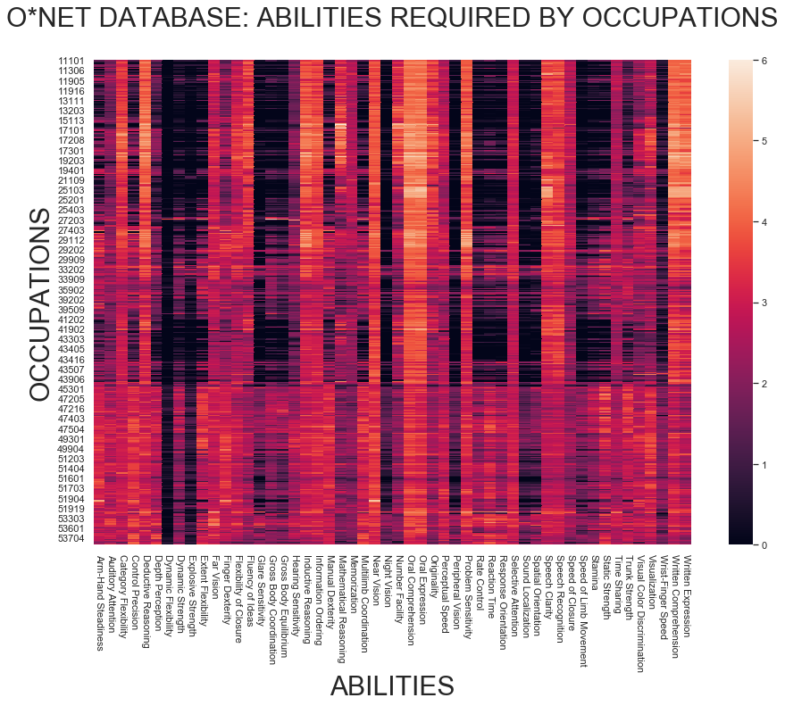
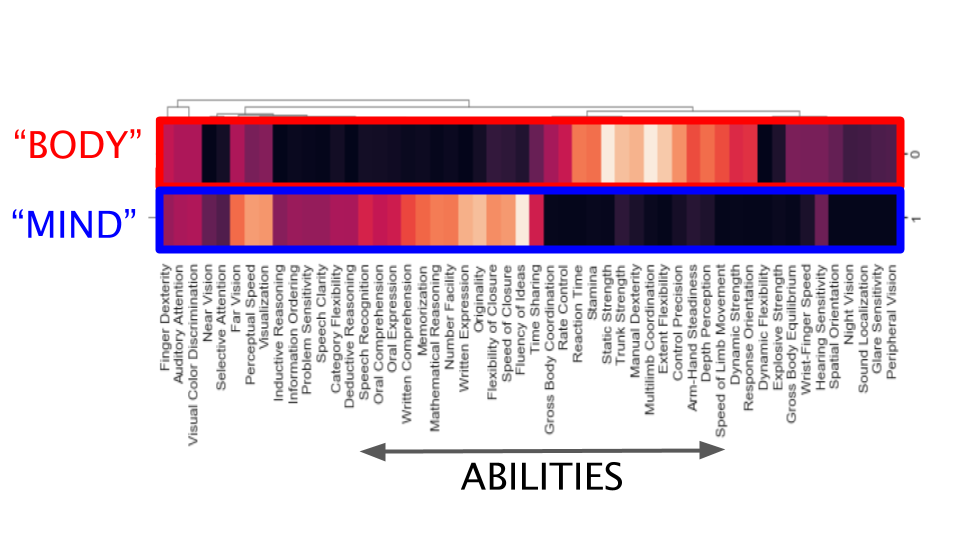
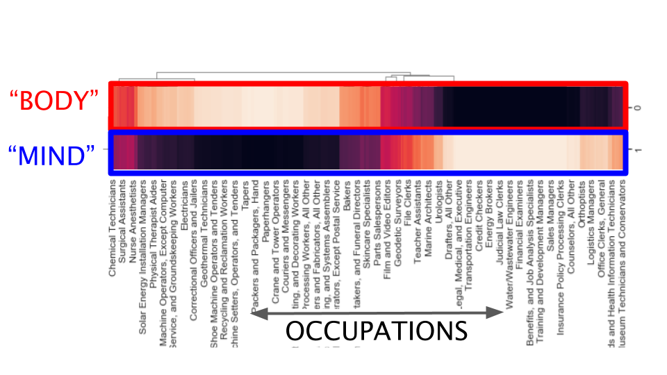
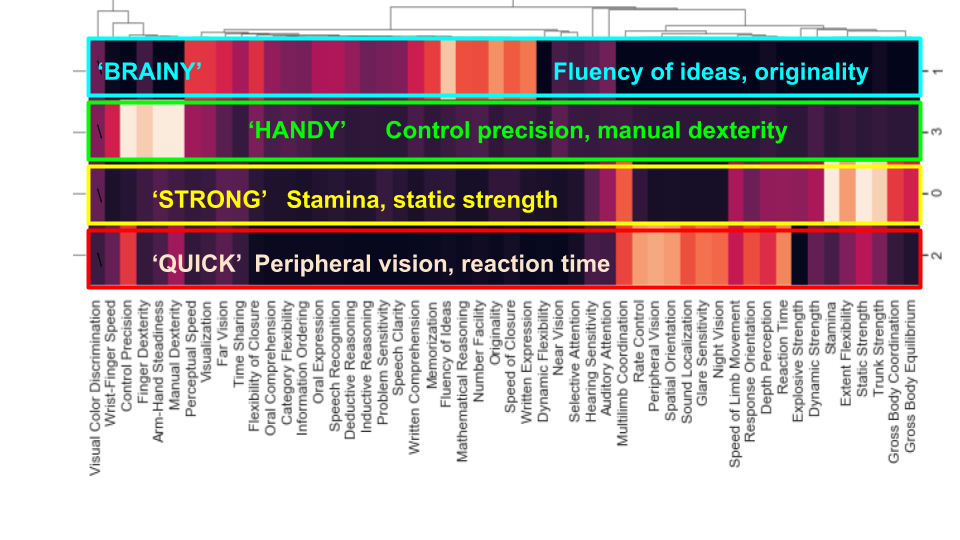
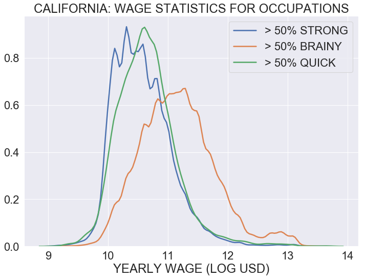
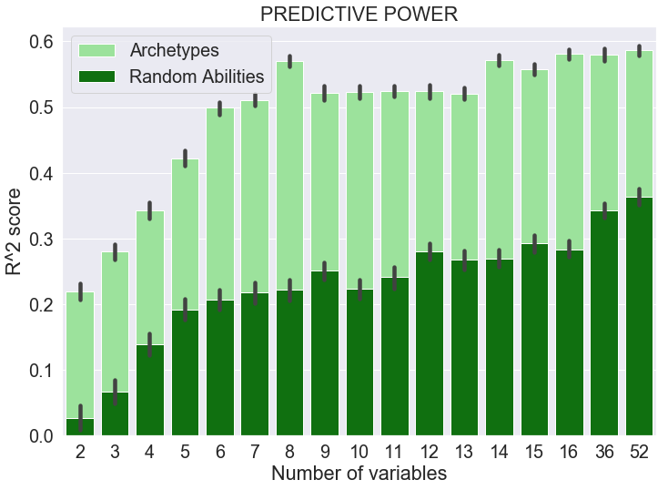
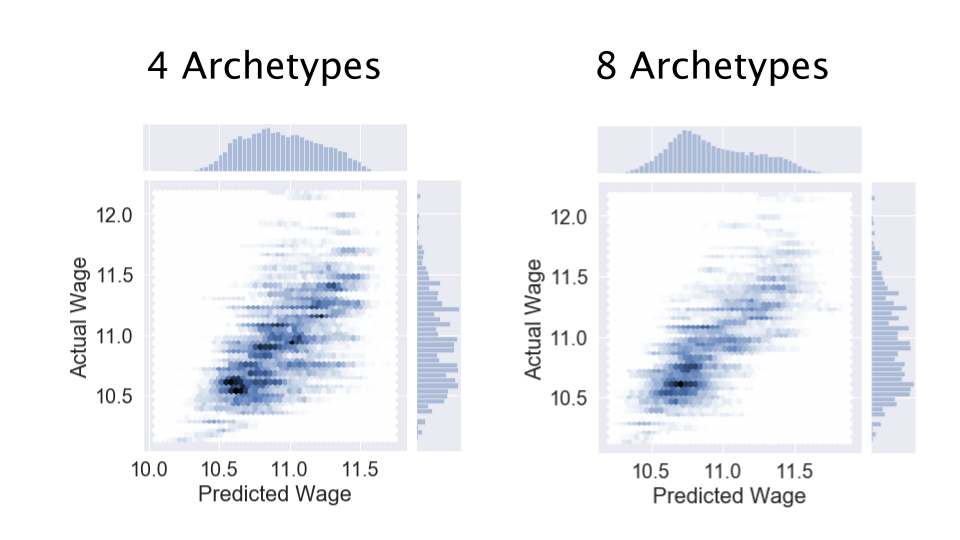

# OCCUPATIONAL ARCHETYPES: A 'MYERS-BRIGGS' FOR JOBS  

David Nordfors        
Github: dnordfors

## The Challenge: Grasping the Rapidly Changing Job Market and the Value of Talent 
Well paid jobs require abilities, skills and knowledge. The O*Net database maps the profiles for a wealth of occupations. Wages of people working in these occupations is available in the US Census ACS/PUMS database. With all the data available, top quality research and huge economic resources being put into human resources, still **only one out of twenty people have a job that fits them and that engages them**. The world's most important industry – the one that billions of people to work – has merely a *five percent* success rate. This is beyond a matter of lacking resources, there must be structural deficiencies. I am suggesting it lacks the language for analysing, strategizing and executing on goals.   

We are used to looking at what jobs require from people. But that is not working as well as it used to. Occupations are changing or disappearing at a high speed and confusion follows. 

### The O*NET Database
The O*NET database remains useful, it profiles nearly a thousand occupations, ranking what each occupation requires from workers, with regards to abilities, knowledge, skills, and so on. It covers in the order of two hundred features.

It has a hierarchical ordering: 23 Major occupation groups, 97 Minor ones, 461 Broad occupations and 840 Detailed occupations

Here below is a part of the O*NET database, showing the need of 52 abilities in the 461 broad occupations. The data is relevant and good, but challenging to overview at-a-glance; the plot is a pleasant piece of computer-generated art, not much else.   

## Proposal: Talent-Based Archetypes Covering Most Jobs
In this project I explore how data science can be used to construct a simple language for jobs and abilities that teams and individuals can use in daily speech. It is related to Jungian psychology and ‘archetypes’, like in the  ‘Myers-Briggs’ personality test, that already are in use in HR.  

The method has the following attractive features:
- **Archetypes are easily kept up-to-date**. If the O*Net data changes, or other data sources are added, the Archetypes adapt. 
- **Archetypes are adaptable**, they can be tailored to be relevant for subgroups. For example, Archetypes might be different in Alaska and Alabama. Archetypes created from the statistics of deaf people can differ from the average statistics.
- **Archetypes have mathematical relevance**. Their relevance can be measured and, if good enough, they will be useful for spotting and discussing trends and correlations. Spoken language and  mathematical analytics are kept in sync.  
- **Archetypes may offer more insight and better recommendations when matching individual workers with jobs**. They can say if there is a mismatch between archetypes for workers' talents, showing which combinations of human talent often co-occur, and the job-archetypes, showing with combinations the job-market typically accomodate.  

The construction of Archetypes has two steps. 

## 1. BUILDING THE ARCHETYPES      

The archetypes are constructed by applying NMF (Non-zero matrix factorization), a method that generally can be used for sorting data into 'topics', to the O*Net database. The number of Archetypes is set by choice. 

Here, the data in the Onet database, shown here above, has been reconstructed into two archetypes, which might be labeled "body" and "mind", because of the way the abilities cluster. The abilities of each archetype are normalized, their intensities sum up to one. 

The archetypes' relation to abilities is mirrored by their relation to occupations. In this figure, instead of normalizing the archetypes, I have normalized the occupations so that it shows how many percent 'body' vs. 'mind' an occupation is. It's a clear cut on the whole, with two regions of jobs that are significantly mixed. People who like to exercise both mind and body may be interested in a closer look at these.   

## ARCHETYPE ANALYTICS

The figures above include an addition to the Onet data: the number of people who practice each occupation. This is demographic information from the US census ACS/PUMS database. They are for Californians between ages 40-65.

The number of archetypes is entirely a question of choice. Here I have chosen to divide all workers into four archetypes, which I have given suitable nicknames. The algorithm divides Californian workers' occupations into clusters with similar abilities. 

Archetype statistics and analytics can be automatically generated from the combined of O*Net and Census ACS/PUMS data. Here are examples of stats generated for the archetypes above. As expected, 'brainy'jobs pay better than jobs that are about being strong or quick. 

The 'handy' archetype is not included, because all jobs are less than 50% 'handy'. In the O*Net database, there are two broad 'handy' occupations that reach the mark: silver smiths and tailors, but apparently there are too few of them in the California statistics to be visible in the plot. 

This is just one example; the opportunity to design statistics are endless and they will automatically adapt to the choice of arhetypes. 

## USING ARCHETYPES FOR MAKING PREDICTIONS 

The mathemacial method behind constructing the archetypes, NMF, is kin to Singular Value Decomposition, which is a standard method for dimensionality reduction. Predictions can be improved by lowering the number of dimensions by grouping correlated variables. This is, in fact, the key behind the archetypes: a simpler AND more powerful language for jobs and abilities. 

Average wages for occupations depend on many more variables than just the worker's abilities: skills and education are also important, as well as many others, and we can expect a good portion of randomness, too. So we cannot expect too much from abilities. How much? This can be tested, and I have done it with both archetypes and abilities. As expected, archetypes are much more powerful for making predictions. 

Here below is the comparison. The R^2-score approximates how much of the variance can be explained by the model. An R^2-score of 1.0 says the model delivers perfect predictions, so I cannot expect to come close to that in this case. 

I compare using a number of archetypes with an equal number of sampled abilities. The archetypes perform much better. Eight archetypes is the optimal set of variables for the present data, managing to predict roughly half of wage differences. The set of four archetypes that I have shown above is not as good, but it still has a predictive power for wages close to one-third, and it's simplicity makes it an efficient tool for spoken conversation about abilities and the labor market. 

The quality of the fit is shown here, for four and eight archetypes, respectively. 

## CONCLUSIONS AND SUGGESTED NEXT STEPS

Conclusions

- Archetypes for the labormarket can be created from  O*net and Census,
- Archetypes can be constructed to match demographics and regions.
- Archetypes is a tool for designing and automating analytics
- Archetypes have predictive power

Next steps:

- Build a web-app
- Find more data sources
- Explore more analytics
- Explore predictive powers
- Test archetypes in HR, for improving communication within teams.
- Match archetypes with profiled users, test for education and job search. 
<!-- Docs to Markdown version 1.0β17 -->
